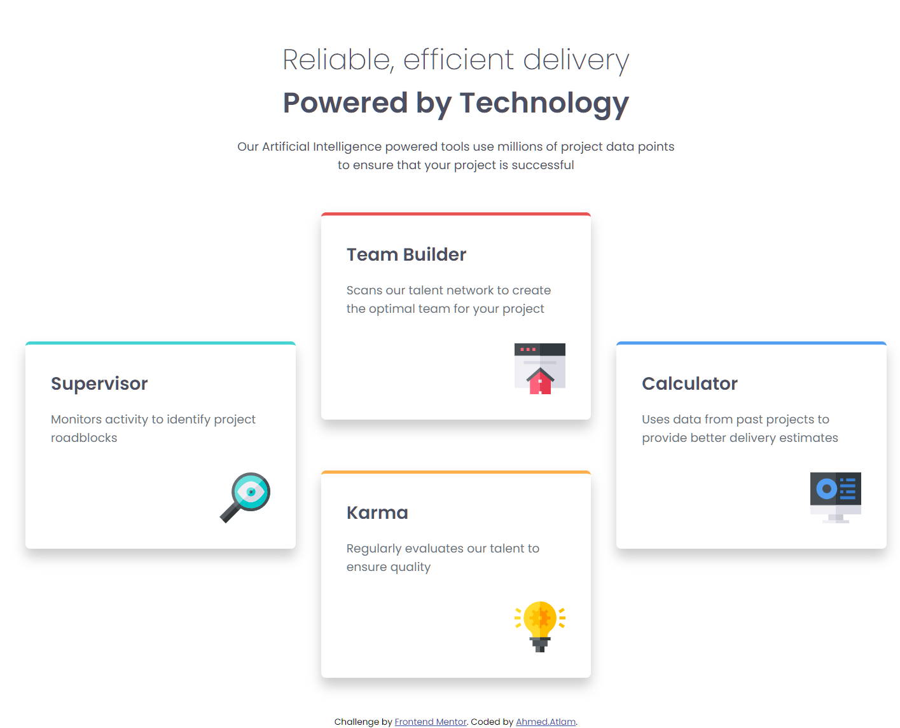

# Frontend Mentor - Four card feature section solution

This is a solution to the [Four card feature section challenge on Frontend Mentor](https://www.frontendmentor.io/challenges/four-card-feature-section-weK1eFYK).

### Screenshot

### Links

- Solution URL: [solution URL](https://github.com/ahmedattlam10/Four-card-feature-section)
- Live Site URL: [live site URL](https://ahmedattlam10.github.io/Four-card-feature-section/)

### Built with

- Semantic HTML5 markup
- CSS custom properties
- CSS Grid
- Mobile-first workflow

## Author

- Website - [Ahmrd Atlam](https://github.com/ahmedattlam10)
- Frontend Mentor - [@ahmedattlam10](https://www.frontendmentor.io/profile/ahmedattlam10)

